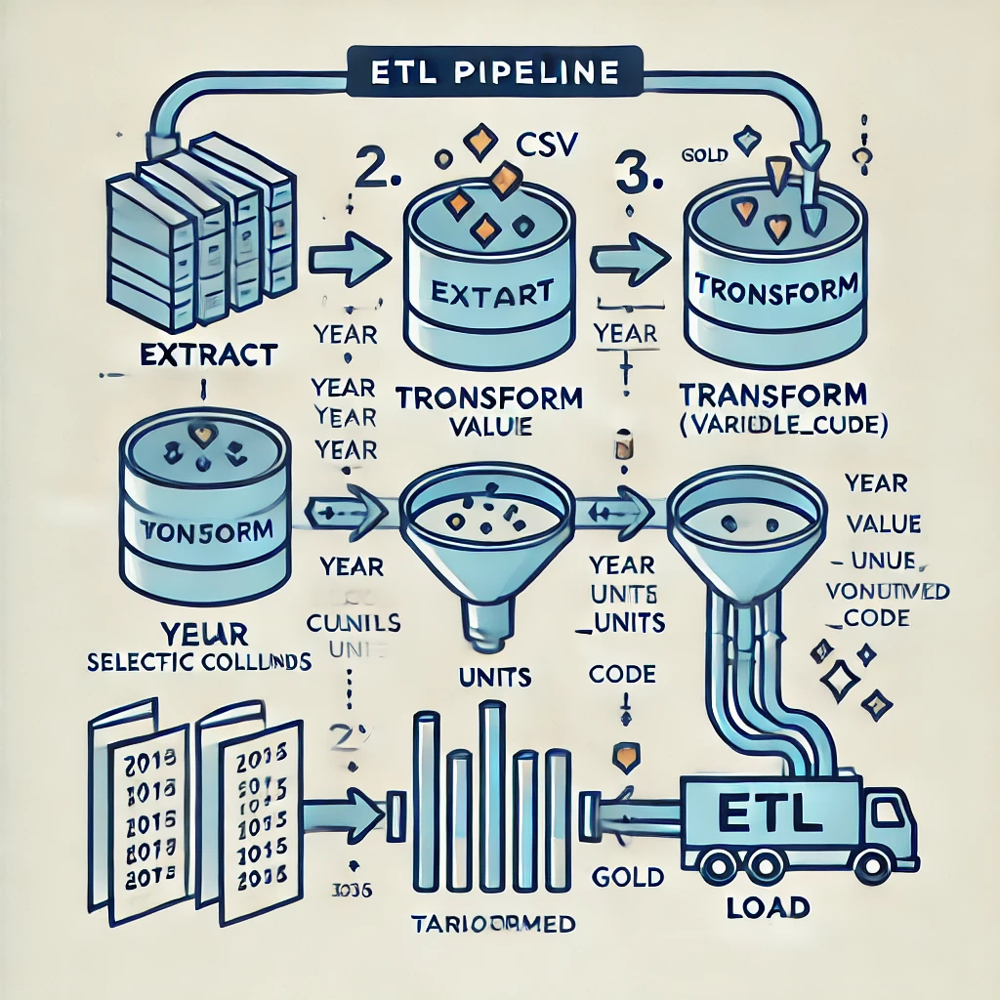

# assignment_ayeshayounus


# CoreDataEngineers ETL Pipeline Project

## Project Overview

This project involves creating a simple ETL (Extract, Transform, Load) pipeline using Bash scripting. The objective is to automate the extraction of data from a CSV file, perform transformations, and load the transformed data into structured directories. Additionally, we will be scheduling this pipeline to run daily using cron jobs. The project also includes SQL queries for analyzing the data within a PostgreSQL database.

## Setup Instructions

### 1. Prerequisites

Before you run the scripts, make sure you have the following installed on your system:

- **Linux/Unix-based OS**: The infrastructure is based on a Linux environment.
- **Bash**: Bash shell for running the ETL scripts.
- **PostgreSQL**: PostgreSQL database server should be installed.
- **Git**: Version control system for managing scripts and documentation.

### 2. Environment Setup

1. **Clone the Repository**:

   ```bash
   git clone https://github.com/yousraiq/assignment_ayeshayounus.git
   cd your-repository

### 3. Database Setup:
Ensure PostgreSQL is installed and running on your machine.

Create a new database named posey:

Ensure PostgreSQL is installed and running on your machine.

Create a new database named posey:
createdb posey

## Set Permissions:

Ensure that your Bash scripts are executable. Run the following command to set executable permissions:
chmod +x Scripts/Bash/*


## Scripts
- **Bash Scripts**: Located in `Scripts/Bash/`
- **SQL Scripts**: Located in `Scripts/SQL/`

## Script Descriptions

## 1. ETL Bash Script (Scripts/Bash/ETL.sh)

This script performs the following steps:

Extract: Downloads a CSV file from a URL (provided as an environment variable) and saves it into the raw folder.
Transform: Renames the Variable_code column to variable_code, selects specific columns, and saves the transformed data into the Transformed folder.

Load: Moves the transformed file into the Gold folder.

## 2. File Moving Script (Scripts/Bash/mcsv_json_move.sh)

This script moves all CSV and JSON files from one folder to another named json_and_CSV.

## 3. PostgreSQL Data Loading Script (Scripts/Bash/locsv_load.sh)

This script iterates over each CSV file and imports the data into the posey PostgreSQL database.

## Diagram


## Usage

First, ensure that the required environment is set up, including Bash and PostgreSQL. The ETL process can be executed by running the provided Bash script, which automates the extraction of data from an external CSV file, transforms the data by renaming a column and selecting specific columns (year, Value, Units, and variable_code), and then loads the transformed data into the final directory. The script is scheduled to run daily at 12:00 AM using a cron job, which is configured via the crontab -e command. This ensures that the pipeline runs automatically every day without manual intervention. You can manually run the script by executing it from the terminal, and the pipeline will handle the extraction, transformation, and loading processes seamlessly

## Usage Instructions

## 1. Running the ETL Script
To manually run the ETL pipeline, navigate to the Scripts/Bash directory and execute the script:
./etl_script.sh

## 2. Scheduling the ETL Script with Cron
To schedule the script to run every day at 12:00 AM, follow these steps:

1. Open the crontab editor:
crontab -e
2. Add the following line to schedule the ETL script:
0 0 * * * /d/assignment_ayesha/assignment_ayesha/ETL.sh

Save and close the crontab file. The ETL script will now run daily at 12:00 AM.

## 3. Running the File Moving Script
To move all CSV and JSON files into the json_and_CSV folder, run:
./move_files.sh


## 4. Loading Data into PostgreSQL
To load the CSV data into the PostgreSQL posey database, run:
./load_to_postgres.sh


## SQL Queries  
## 1.  Find Order IDs with Large Quantities
-- Find a list of order IDs where either gloss_qty or poster_qty is greater than 4000.
SELECT id
FROM orders
WHERE gloss_qty > 4000 OR poster_qty > 4000;

## 2. Orders with Zero Standard Quantity and Large Other Quantities
-- Returns a list of orders where standard_qty is zero and either gloss_qty or poster_qty is over 1000.
SELECT *
FROM orders
WHERE standard_qty = 0 AND (gloss_qty > 1000 OR poster_qty > 1000);

## 3. Find Company Names Starting with 'C' or 'W' and Containing 'ana'
-- Find all the company names that start with a 'C' or 'W', 
-- and where the primary contact contains 'ana


